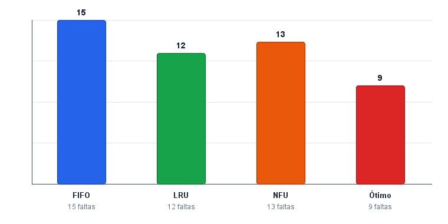

# Simulador de Algoritmos de Substituição de Páginas

Simulador em Java puro (sem dependências externas) para comparar o número de **faltas de página** geradas por quatro algoritmos clássicos de substituição: **FIFO**, **LRU**, **NFU** e **Ótimo**. Possui modo terminal (CLI) e interface gráfica em Swing com gráfico de barras comparativo.

> Trabalho da disciplina de Sistemas Operacionais — Universidade de Fortaleza (Ciência da Computação).
> Relatório completo: [docs/relatorio/RELATORIO.md](docs/relatorio/RELATORIO.md) (PDF: [RELATORIO.pdf](RELATORIO.pdf)).



## Algoritmos implementados

| Algoritmo | Estratégia                                                                                     |
| --------- | ---------------------------------------------------------------------------------------------- |
| **FIFO**  | Remove a página há mais tempo na memória (fila).                                               |
| **LRU**   | Remove a página menos recentemente usada.                                                      |
| **NFU**   | Remove a página com menor contador de referências acumuladas.                                  |
| **Ótimo** | Remove a página cujo próximo uso está mais distante no futuro (referência teórica de Bélády). |

## Requisitos

- **JDK 11** ou superior (testado com JDK 21).

## Estrutura do projeto

```text
src/
├── Main.java                          # ponto de entrada (CLI / GUI)
├── gui/
│   ├── SimuladorGUI.java              # janela principal Swing
│   └── GraficoComparativo.java        # gráfico de barras (JPanel)
└── simulator/
    ├── SimuladorSubstituicao.java     # orquestra a execução dos 4 algoritmos
    ├── ResultadoSimulacao.java        # resultado por algoritmo
    ├── EntradaSimulacao.java          # parsing/validação das entradas
    └── algoritmos/
        ├── AlgoritmoSubstituicao.java # interface comum
        ├── FIFO.java
        ├── LRU.java
        ├── NFU.java
        └── Otimo.java
```

## Compilar

**Linux / macOS (bash):**

```bash
javac -encoding UTF-8 -d out $(find src -name "*.java")
```

**Windows (PowerShell):**

```powershell
javac -encoding UTF-8 -d out (Get-ChildItem -Recurse -Filter *.java -Path src).FullName
```

## Executar

### Interface gráfica (padrão)

```bash
java -cp out Main
```

A janela abre com a cadeia clássica e 3 quadros já preenchidos. Basta clicar em **Simular** para ver a tabela de resultados e o gráfico.

### Modo terminal (CLI)

```bash
java -cp out Main --cli
```

O programa pedirá:

1. A cadeia de referências (inteiros separados por espaço).
2. O número de quadros de memória.

E imprimirá:

```text
Método 1 (FIFO ) - 15 faltas de página
Método 2 (LRU  ) - 12 faltas de página
Método 3 (NFU  ) - 13 faltas de página
Método 4 (Ótimo) -  9 faltas de página
```

## Caso de validação

Cadeia clássica da literatura (TANENBAUM, *Sistemas Operacionais Modernos*):

```text
Cadeia:  7 0 1 2 0 3 0 4 2 3 0 3 2 1 2 0 1 7 0 1
Quadros: 3
```

Resultado esperado:

| Algoritmo | Faltas |
| --------- | :----: |
| FIFO      |   15   |
| LRU       |   12   |
| NFU       |   13   |
| Ótimo     |    9   |

## Gerando o screenshot do gráfico (opcional)

O arquivo `docs/grafico-comparativo.png` é gerado por um pequeno utilitário que renderiza o painel Swing fora da tela. Para regerar:

```powershell
javac -encoding UTF-8 -d out (Get-ChildItem -Recurse -Filter *.java -Path src).FullName
javac -encoding UTF-8 -cp out -d out docs\ExportarGrafico.java
java -cp out ExportarGrafico
```

## Autores

- Luiz Carlos Filho
- Nelson
